# 실습 1번

## 실행화면

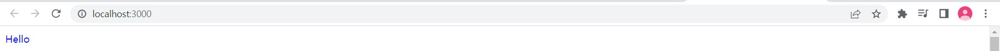
  

## 설계방법 / 코드설명

### App.js

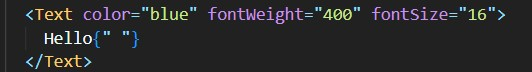

- Text 컴포넌트를 통하여 해당 글자를 화면에 나타냄
- 원하는 텍스트의 색, 굵기, 크기 값을 넘겨줌
    

### Text / index.js

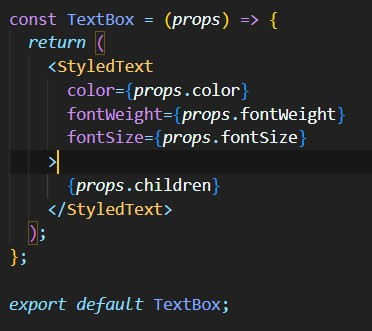

- props를 통해 App.js로 부터 받아온 글자 색, 굵기, 크기를 StyledText에 넘김
- props.children을 통해 App.js 파일에서 Text 태그 내에 작성된 텍스트를 가져옴
- 최종적으로 TextBox 함수를 내보내고 App.js에서 이를 받아서 사용
    

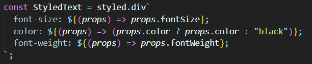

- style component를 통해 StyledText 태그를 생성하여 props를 통해 받은 글자 색, 굵기, 크기에 대한 스타일을 지정해줌
    

# 실습 2번

## 실행 화면

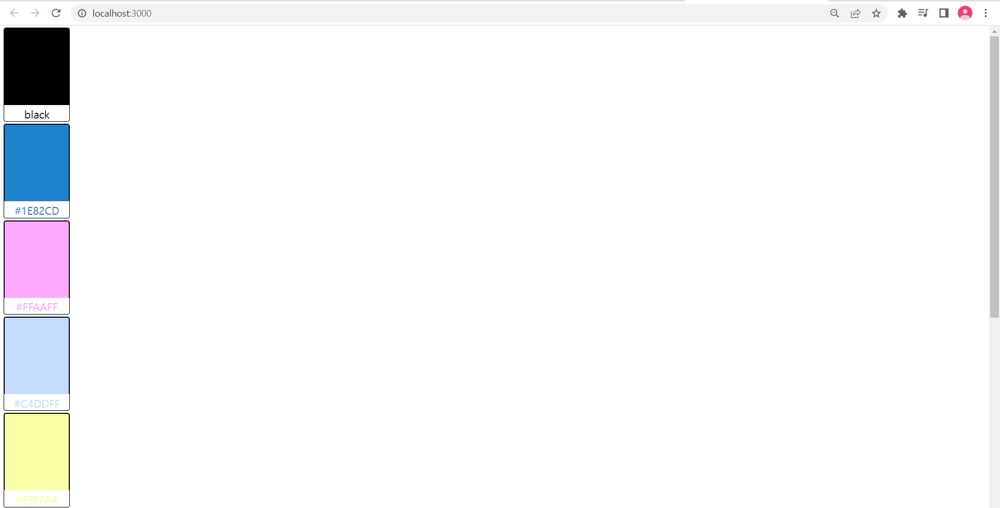
  

## 설계방법 / 코드설명

### ColorCard 구성

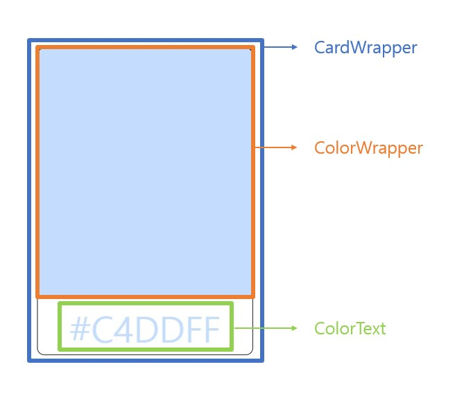
  

### App.js

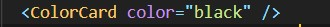

- ColorCard 컴포넌트를 통해서 화면에 ColorCard를 나타냄
- 적용할 카드 색을 넘겨줌
    

### ColorCard / index.js

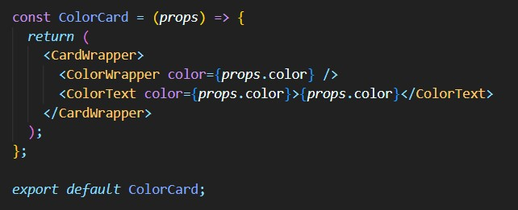

- CardWrapper 태그를 통해 ColorCard 전체 박스를 만들고 그 안에 색 박스 ColorWrapper과 색 텍스트 ColorText 태그를 배치함
- App.js에서 넘겨받은 color 값을 다시 ColorWrapper과 ColorText 컴포넌트로 넘겨줌
- 최종적으로 ColorCard 함수를 내보내고 App.js에서 이를 받아 사용
    

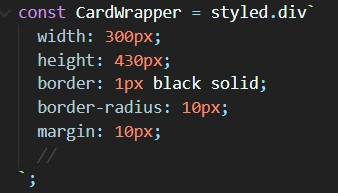

- 구성 사진에서 볼 수 있듯이 가장 큰 박스를 나타냄
- 박스 선을 설정하고 박스 모서리도 조금 둥글게 만듦
- margin을 통해 전체 창에서 조금 떨어지도록 설정함
    

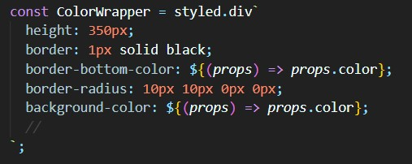

- 구성 사진에서 볼 수 있듯이 큰 박스 안의 작은 색 박스를 나타냄
- 작은 박스의 외곽선을 설정하고 박스 모서리도 조금 둥글게 만듦
- 박스의 배경색과 아래쪽 외곽선의 색을 props를 통해 전달 받은 color 값으로 설정함
    

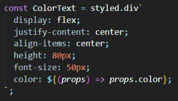

- 구성 사진에서 볼 수 있듯이 큰 박스 안의 텍스트 박스를 나타냄
- flex를 통해 박스를 주축, 반대축에 대해 가운데 정렬함
- 글씨 색깔은 props를 통해 전달 받은 color 값으로 설정
    

# 실습 3번

## 실행화면

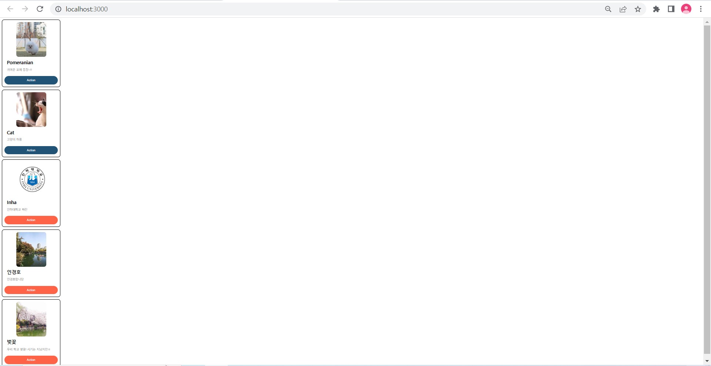
  

## 설계방법 / 코드설명

### ColorCard 구성

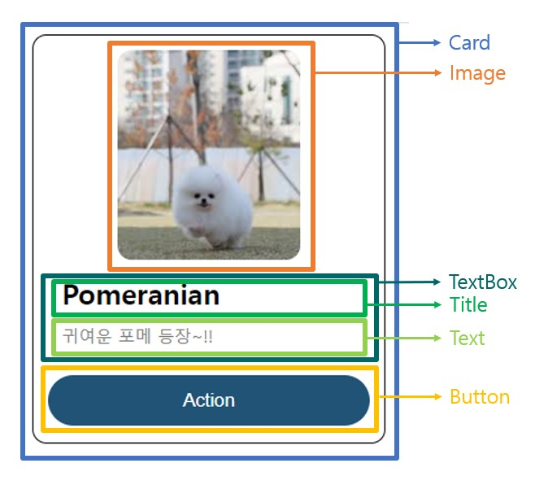
  

### App.js

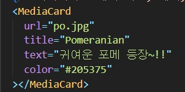

- MediaCard 태그를 통해서 화면에 나타냄
- 이미지 주소, 제목, 내용, 버튼 색깔 값을 넘겨줌
    

### MediaCard / index.js

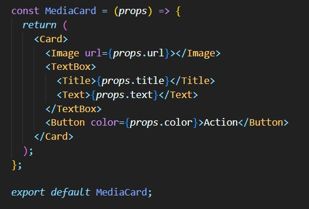

- Card 태그를 통해 MediaCard의 제일 바깥쪽 박스를 생성함
- Card 박스 안에 Image(이미지 박스), TextBox(제목+내용), Button(버튼 박스)를 차례로 배치함
- App.js 파일에서 넘겨받은 props의 값을 각각 태그의 필요에 맞게 다시 넘겨줌
- 최종적으로 MediaCard 컴포넌트를 내보내 App.j에서 사용함
    

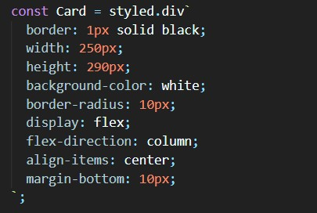

- 구성 사진에서 볼 수 있듯이 가장 바깥쪽 박스를 나타냄
- 박스 선을 나타내주고 모서리도 조금 둥글게 설정함
- 박스의 배경을 하얀색으로 설정함
- flex를 통해 가로 방향에 대해서 item들을 가운데 정렬함
    

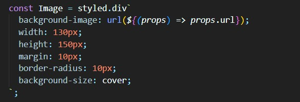

- 구성 사진에서 볼 수 있듯이 이미지 박스를 나타냄
- background-image를 사용하여 props를 통해 받은 url 값을 통해 이미지를 넣어주고 모서리를 조금 둥글에 설정함
- 가로, 세로 길이를 설정해주고 margin을 바깥 여백을 설정해줌
- background-size: cover을 통해 이미지 크기를 맞춤
    

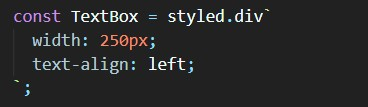

- 구성 사진에서 볼 수 있듯이 MediaCard의 제목과 내용을 포함한 박스를 나타냄
- text-align을 통해 박스 내의 컴포넌트들의 텍스트를 왼쪽으로 정렬함
    

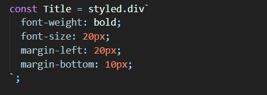

- 구성 사진에서 볼 수 있듯이 제목 박스를 나타냄
- margin을 왼쪽, 아래에 주어 여백을 줌
    

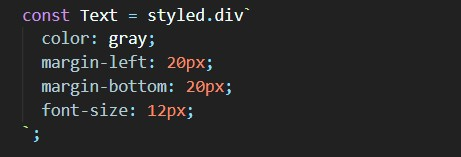

- 구성 사진에서 볼 수 있듯이 내용 박스를 나타냄
- margin을 왼쪽, 아래에 주어 바깥 여백을 줌
    

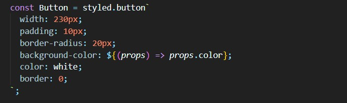

- 구성 사진에서 볼 수 있듯이 마지막에 버튼 박스를 나타냄
- padding을 주어 박스 안쪽 여백 생성
- 박스 선을 안보이게 0으로 설정하고 박스의 모서리는 조금 둥글게 만듦
- 버튼의 배경색은 props를 통해 전달 받은 color 값으로 설정하고 버튼 안의 텍스트 색은 흰색으로 설정
    
